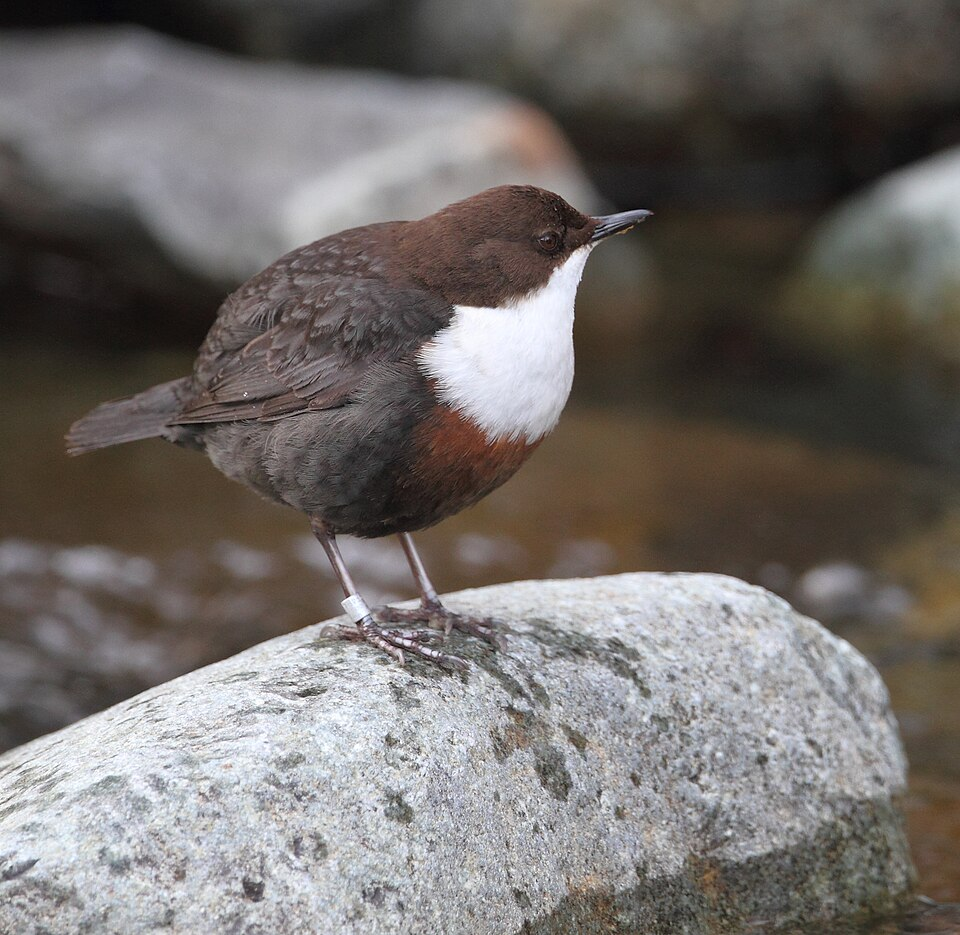
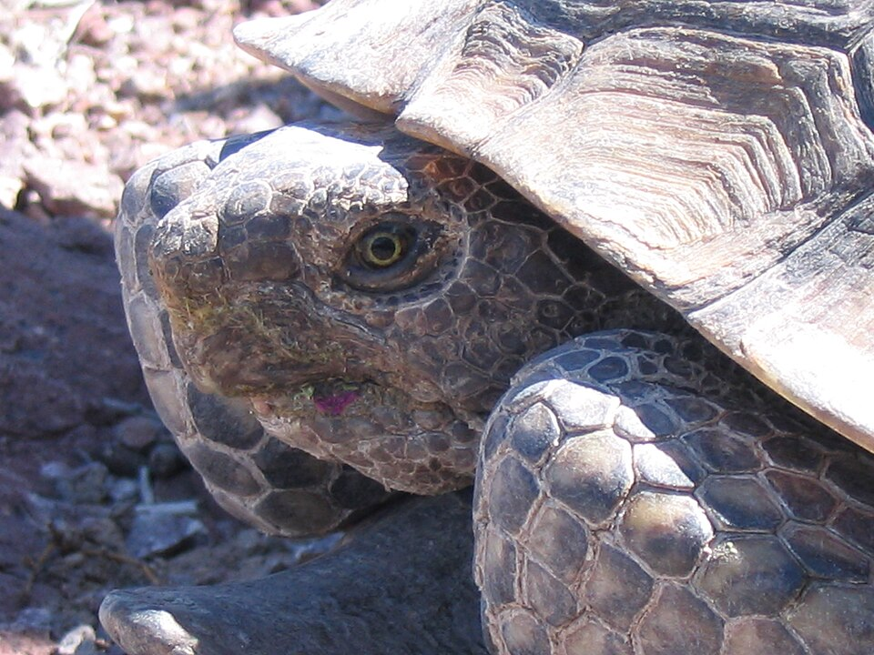

## Objectifs 

Ce TP fait le pont direct avec vos cours magistraux. Vous allez y explorer les deux facettes fondamentales de l'écologie quantitative : 

1. **L'approche du détective (Modèle statistique) :** Comment estimer la vraie survie d'une population quand on rate des individus sur le terrain (détection imparfaite) ?

2. **L'approche de l'architecte (Modèle de processus) :** Comment utiliser ces estimations pour construire un système, simuler l'avenir et tester des stratégies de conservation ?

À l'issue de cette séance, vous serez capables de :

* Lire et interpréter un historique de Capture-Marquage-Recapture (CMR).

* Ajuster un modèle simple pour séparer la survie ($\phi$) de la probabilité de détection ($p$).

* Construire une matrice de Leslie et simuler la dynamique d'une population structurée en stades (cinétique).

* Évaluer la sensibilité d'une espèce longévive, en lien avec la "spirale de l'extinction" vue en cours.

## Avant de vous lancer...

Pour travailler sereinement, créez un nouveau script (nommez-le par exemple `TP1_Systemes_Dynamiques.R`) à l'intérieur de votre projet sous RStudio.

Bonne nouvelle : **vous n'aurez aucun fichier externe à télécharger ou à importer pour ce TP !** Les données sont déjà intégrées dans les packages R que nous allons utiliser. 

Vous avez juste besoin de charger trois bibliothèques (installez-les via la console de RStudio si ce n'est pas encore fait avec `install.packages(c("marked", "popbio", "tidyverse"))`) :

```{r setup, message=FALSE, warning=FALSE}
library(tidyverse) # La caisse à outils pour manipuler les données
library(marked)    # Pour les modèles de Capture-Marquage-Recapture (Le Détective)
library(popbio)    # Pour les matrices de dynamique des populations (L'Architecte)
```

## Le Détective : Inférence et Probabilité de Détection (CMR)

Sur le terrain, la réalité est complexe : un animal vivant n'est pas toujours observé. Comme vu en CM avec les comptages de mésanges en fôret, la probabilité de détection ($p$) est presque toujours inférieure à 1. 

Nous allons utiliser le jeu de données `dipper` (inclus dans le package `marked`). Il s'agit d'un suivi réel du Cincle plongeur (*Cinclus cinclus*), un petit oiseau aquatique, suivi pendant plusieurs années.

{width="50%" fig-align="center"}

### Étape 1 : Regarder les données brutes

Avant de modéliser, regardons à quoi ressemble un fichier CMR.

```{r load-dipper}
# Chargement et affichage des 6 premières lignes du jeu de données
data(dipper)
head(dipper)
```

> **Observation :** Dans la colonne `ch` (*capture history*), vous voyez des suites de 0 et de 1 (ex: `1100000`).
> 
> * Un `1` signifie que l'oiseau a été capturé ou revu cette année-là.
> 
> * Un `0` signifie qu'il n'a **pas** été vu.
> 
> Si vous voyez un historique comme `1010000`, cela signifie que l'oiseau a été vu l'année 1, raté l'année 2, puis revu l'année 3. **Puisqu'il a été revu l'année 3, il était obligatoirement vivant l'année 2 !** Cet historique prouve que l'on rate des individus et justifie l'utilisation de modèles mathématiques.

### Étape 2 : L'ajustement du Modèle de Cormack-Jolly-Seber (CJS)

Nous allons demander à R d'estimer la survie ($\Phi$) et la probabilité de détection ($p$). Nous utilisons l'argument `formula = ~1` pour dire à R : *"Estime une valeur moyenne constante pour toute la période, sans différencier les années ou les sexes"*.

```{r cjs-model, message=FALSE, warning=FALSE}
# Ajustement du modèle CJS
modele_cjs <- crm(dipper, 
                  model = "cjs", 
                  model.parameters = list(Phi = list(formula = ~1), 
                                          p = list(formula = ~1)))

# Affichage des probabilités réelles estimées
predict(modele_cjs)
```

> **Point R :** Ne vous laissez pas impressionner par les lignes de calcul de l'algorithme d'optimisation dans la console de RStudio. Regardez le tableau final produit par `predict()`.
>
> * La probabilité de survie moyenne d'une année sur l'autre ($\Phi$) est d'environ **0.56 (56%)**.
>
> * La probabilité de détection ($p$) est d'environ **0.90 (90%)**. Cela signifie que les chercheurs ont raté en moyenne 10% des oiseaux vivants à chaque sortie.

Une valeur moyenne globale masque parfois des disparités biologiques fondamentales. En écologie des populations, les rôles écologiques, l'effort reproducteur ou les comportements territoriaux diffèrent souvent entre mâles et femelles. Vérifions si la survie ($\Phi$) est équivalente entre les sexes en intégrant la covariable `sex` dans les formules du modèle :

```{r, message=FALSE, warning=FALSE, results=FALSE}
mod_sexe <- crm(dipper, model = "cjs", 
                model.parameters = list(Phi = list(formula = ~sex), 
                                        p   = list(formula = ~1)))                                   
```

Utilisez ensuite la fonction `predict` pour afficher l'estimation des paramètres du modèle :
```{r}
predict(mod_sexe)   
```

**Questions d'interprétation :**

1. **Survie différentielle et probabilités cumulées :**
   * Quelle est la différence annuelle brute de survie entre mâles et femelles ?
   * Calculez la probabilité pour un individu d'être encore vivant au bout de 5 ans dans chaque sexe ($\Phi^5$). Que constatez-vous sur l'écart relatif entre mâles et femelles après quelques années ?

2. **Biais de détection ($p$) :**
   * Si un écologue de terrain n'utilisait pas de modèle CJS et calculait simplement le ratio des oiseaux revus d'une année sur l'autre, quelle valeur approchée de survie obtiendrait-il ($\Phi \times p$) ? Pourquoi confondre « non-détecté » et « mort » est-il risqué ?
   * Comparez la probabilité de détection ($p$) estimée pour les femelles et pour les mâles (changer le code pour vous-même). Constatez-vous une différence notable ? En vous renseignant brièvement sur l'aspect visuel (plumage) et les comportements territoriaux du Cincle plongeur (*Cinclus cinclus*), quelles caractéristiques biologiques de cette espèce expliquent logiquement cette divergence (ou similitude) de détectabilité pour l'observateur ?


## L'Architecte : Le Modèle Matriciel Structuré

Le détective vient d'estimer la survie ($\Phi$) et la détection ($p$). Mais la survie n'est qu'une pièce du puzzle. 

Sur le terrain, les écologues déploient une vaste panoplie de modèles statistiques (que nous ne verrons pas dans ce TP) pour estimer l'ensemble des traits d'histoire de vie d'une population, par exemple :

* **La fécondité ($F$) :** estimée par le suivi des pontes, des nichées ou par des modèles de comptage (ex. modèles de Poisson ou binomial négatif).

* **L'âge à la première reproduction ($E$) :** estimé via des modèles multi-états ou des suivis longitudinaux d'individus d'âge connu.

* **Les probabilités de transition / maturation ($\psi$) :** estimées via des modèles de Capture-Marquage-Recapture multi-sites ou multi-états (ex. passage du statut "juvénile" à "adulte").

Une fois ces paramètres estimés par les « détectives », ils ne restent pas de simples chiffres isolés dans un tableau : **l'architecte s'en empare pour construire la matrice de projection**. 

Chaque case d'une matrice démographique (Matrice de Leslie ou de Lefkovitch) correspond précisément à l'un de ces paramètres vitaux estimés sur le terrain. Nous changeons maintenant d'espèce et d'échelle : nous allons assembler ces briques pour simuler le devenir de la population et orienter les décisions de gestion.

Nous allons analyser la population d'Orques (*Orcinus orca*), avec le jeu de données `whale` du package `popbio`.

{width="65%" fig-align="center"}

### Étape 1 : Décortiquer la matrice

```{r load-whale}
# Chargement et affichage de la matrice de l'orque
data(whale)
whale
```

> **Observation :** Cette matrice carrée $4 \times 4$ répartit les individus en 4 stades de développement : *yearling* (1 an), juvénile, adulte mature, et post-reproductive (ménopause).
>
> * Les colonnes représentent le temps $t$.
>
> * Les lignes représentent le temps $t+1$.
>
> * La **première ligne** contient la fécondité (seules les adultes matures se reproduisent, avec un taux de 0.04).
>
> * Les **autres lignes** contiennent les probabilités de survie et de passage d'un stade à l'autre.

### Étape 2 : Cinétique et Projection Démographique

La cinétique décrit "comment" l'abondance varie dans le temps. Simulons ce qui se passerait sur 50 ans si nous démarrions avec une toute petite population de 40 orques (10 dans chaque stade).

```{r projection-whale}
# 1. On crée notre vecteur de population de départ
n_initial <- c(10, 10, 10, 10)

# 2. On lance la projection mathématique sur 50 ans
projection_orque <- pop.projection(A = whale, n = n_initial, iterations = 50)

# 3. On visualise les résultats
stage.vector.plot(projection_orque$stage.vectors, 
                  col = 1:4, 
                  main = "Dynamique cinétique de la population d'Orques")
```

> **Observation :** Regardez les 10 premières années sur le graphique. Les courbes zigzaguent ! C'est ce qu'on appelle **l'inertie démographique** vue en CM. La population met du temps à se "rééquilibrer" par rapport à notre structure de départ artificielle. Ensuite, les courbes deviennent parallèles : la population a atteint sa distribution stable.

La population va-t-elle s'éteindre ou croître ? Pour le savoir, on calcule $\lambda$ (le taux de croissance asymptotique).

```{r lambda-whale}
lambda(whale)
```

Si $\lambda > 1$, la population croît. S'il est $< 1$, elle décline. Ici, $\lambda \approx 1.025$, soit une croissance très lente de 2.5% par an, typique des grands mammifères.

### Étape 3 : Sensibilité et Spirale de l'Extinction

L'orque est une espèce à vie longue (longévive). En cours, nous avons vu que ces espèces sont extrêmement sensibles à une baisse de la survie des adultes. Vérifions-le avec la fonction `sensitivity()`.

```{r sens-whale}
# Calcul de la matrice de sensibilité
sensibilite_orque <- sensitivity(whale)

# Représentation graphique :
image2(sensibilite_orque, 
       log = FALSE, 
       col = c("white", rev(heat.colors(23))),
       labels = c(1, 2),
       mar = c(4.5, 5, 3.5, 1),
       box.offset = 0.1)

# Le haut étant dégagé, le titre se place sans conflit
title("Quels paramètres influencent le plus la croissance ?", line = 1.8)
```

> **Règle de lecture d'une matrice démographique :**

> * **En colonne ($X$, temps $t$) :** le stade de **départ** de l'individu.
> * **En ligne ($Y$, temps $t+1$) :** le stade d'**arrivée** l'année suivante.
> 
> *Chaque cellule se lit donc : « De la colonne vers la ligne ».*

> * La **première ligne** correspond aux naissances (vers le stade *yearling*). Seules les femelles matures s'y projettent (fécondité de 0.04).
> * La **diagonale** correspond aux individus qui survivent et restent dans le même stade d'une année sur l'autre (ex. adulte restant adulte : 0.95).
> * La **sous-diagonale** correspond aux transitions de croissance (ex. juvénile devenant mature : 0.07).

> **Guide d'interprétation du graphique :**
> 
> * **Comment lire la grille :** 
>   1. Choisissez un stade de départ sur l'axe du bas ($t$).
>   2. Remontez verticalement vers le stade d'arrivée sur l'axe de gauche ($t+1$).
> 
> * **Distinction essentielle : Réalité biologique vs Sensibilité mathématique :**
>   * **Transition réelle [juvenile $\to$ mature = 0.567] :** Forte sensibilité. Elle représente la maturation (le passage des grands jeunes vers le stock reproducteur).
>   * **Transition réelle [mature $\to$ mature = 0.579] :** Très forte sensibilité. C'est le maintien des adultes reproducteurs déjà en place, pilier de la population.
>   * **Cas mathématiques théoriques [postreprod $\to$ mature = 0.581] ou [mature $\to$ juvenile = 0.387] :** La sensibilité brute calcule la dérivée mathématique même pour des cases nulles dans la nature. Une orque ménopausée ne redevient jamais mature, et un adulte ne rajeunit jamais en juvénile ($A_{ij} = 0$). En biologie de la conservation, **on ne prend en compte que les cases correspondant à des transitions réelles**.


## À vous de jouer ! (Exercice autonome)

Vous maîtrisez désormais les outils de base. Vous allez les appliquer sur une espèce terrestre très étudiée en biologie de la conservation : **la Tortue du désert** (*Gopherus agassizii*).

{width="55%" fig-align="center"}

**Contexte historique et gestionnaire (Doak et al., 1994) :**
Dans les années 1990, l'armée américaine souhaitait agrandir la base militaire de Fort Irwin, menaçant de détruire jusqu'à 13% de la population restante de Tortues du désert en Californie. Pour évaluer la viabilité de l'espèce, les écologues Doak, Kareiva et Klepetka (1994) ont construit des matrices structurées en 8 stades de taille.

Sur le terrain, la survie des adultes était connue, mais **le recrutement des jeunes tortues était quasi impossible à mesurer** car les nouveau-nés sont minuscules et passent inaperçus sous les buissons. Les auteurs ont donc testé 4 scénarios de fécondité (production annuelle de jeunes femelles par adulte) :

* **`low` :** Comptage brut des jeunes observés (très fortement sous-estimé par la détection imparfaite).
* **`med.low` :** Estimation corrigée (multipliée arbitrairement par 10 pour compenser le biais d'observation).
* **`med.high` et `high` :** Estimations basées sur une population témoin particulièrement saine et féconde (site de Goffs), représentatives d'années humides exceptionnelles.

Ces matrices sont stockées dans la liste `tortoise` du package `popbio`.

**Votre mission :** Exécutez le code ci-dessous étape par étape dans RStudio et répondez aux questions sur votre brouillon.

**1. Découverte des données**
```{r load-tortoise}
data(tortoise)
# Affichons seulement la matrice du scénario "moyenne-haute" (med.high)
tortoise[["med.high"]]
```

**Lecture biologique** 
8 stades de développement : de l'éclosion (yearling) aux très grands individus (adult2). La reproduction ne débute qu'au stade subadulte (subadult, carapace $>180$ mm), ce qui prend entre 15 et 20 ans dans le désert !

**2. Viabilité de la population**
Calculez le taux de croissance ($\lambda$) du scénario `med.high`. 
*Question : Cette population est-elle en croissance ou en déclin dans le cadre de ce scénario?*
```{r lambda-med-high, eval=FALSE}
lambda(tortoise[["med.high"]])
```

**3. Comparaison des scénarios**
La fonction `sapply()` permet d'appliquer la fonction `lambda` aux 4 matrices d'un seul coup. C'est magique !
```{r compare-lambda, eval=FALSE}
sapply(tortoise, lambda)
```
*Question : Que remarquez-vous sur la valeur de $\lambda$, même sous le scénario le plus optimiste (high) ? Si une réserve finance des couveuses artificielles ou des programmes de reproduction en captivité, cela suffira-t-il à sauver l'espèce ?*

**4. Quelle action de conservation privilégier ?**
Générez le graphique de sensibilité pour la population avec une "haute" fécondité. 

```{r sens-tortoise, eval=FALSE}
# Astuce : remplacez "???" par le nom de la matrice "haute" ("high")
sens_tortue <- sensitivity(tortoise[["???"]])

image2(sens_tortue, 
       log = FALSE, 
       col = c("white", rev(heat.colors(23))),
       labels = c(1, 2),
       mar = c(4.5, 5, 3.5, 1),
       box.offset = 0.1)

title("Sensibilité - Tortue du désert", line = 1.8)
```
*Question : Comparez la sensibilité de la reproduction (ligne 1) à celle de la survie des adultes (diagonale adult1). À l'époque, les gestionnaires voulaient abattre les corbeaux qui mangeaient les jeunes tortues. À la lumière de cette matrice, était-ce la stratégie la plus efficace ?*

**5. Boucler la boucle : Du terrain au modèle de projection**

Vous êtes chargé de diagnostiquer la viabilité de la population de Cincles plongeurs que vous avez analysée au début du TP :

* Les suivis de nids indiquent un recrutement de **1.3 jeune femelle par adulte** et une survie juvénile en première année de **0.35**.

* Vous disposez de la survie adulte réelle estimée par votre modèle CMR (**$\Phi = 0.56$**).

Construisez la matrice de Leslie correspondante ($2 \times 2$ : Juvéniles, Adultes) :

```{r cincle-matrix, eval=FALSE}
# 1. Matrice avec la survie estimée par le modèle CJS (Phi = 0.56)
mat_cincle <- matrix(c(???,    ???, 
                       ???,  ???), 
                     nrow = 2, byrow = TRUE)
colnames(mat_cincle) <- rownames(mat_cincle) <- c("Juvénile", "Adulte")

# Taux de croissance asymptotique
lambda(mat_cincle)
```

*Question 1 : La population de cincle est-elle viable avec cette survie estimée (𝜆 >1)?*

*Question 2 : Si un observateur débutant n’avait pas corrigé la détection imparfaite (𝑝 =0.90) et avait estimé la survie brute apparente à 0.50 au lieu de 0.56, quelle aurait été sa conclusion sur l’avenir de la population ?*


::: {.callout-note collapse="true"}
#### Défi : Modéliser le décrochage des trajectoires temporelles [Optionnel - Niveau Avancé]

Un écart de $\lambda$ abstrait (1.010 vs 0.969) ne parle pas toujours aux décideurs. Pour convaincre un gestionnaire, rien ne vaut une courbe de projection comparée.

**Votre défi :**  
À l'aide des fonctions vues plus haut pour l'Orque (`pop.projection`), construisez un script simulant l'évolution des deux populations sur 30 ans à partir d'un stock de départ identique de 100 oiseaux (50 juvéniles et 50 adultes). 

**Cahier des charges :**

1. Définissez la durée (`duree <- 30`) et le vecteur initial `n_depart`.
2. Projetez les deux matrices (`mat_cincle_reelle` et `mat_cincle_naif`) sur cette période. *(Indice : pour couvrir les pas de temps de 0 à 30, demandez `iterations = duree + 1`)*.
3. Extrayez l'abondance totale à chaque pas de temps via `colSums(proj$stage.vectors)` et assemblez-les dans un tableau (`tibble`) contenant une colonne `Annee` (de 0 à 30), une colonne `Reel` et une colonne `Naif`.
4. Passez ce tableau au format long avec `pivot_longer()` pour tracer les deux trajectoires sur un même graphique `ggplot2`.

*(Besoin d'un coup de pouce ? Complétez le canevas ci-dessous en remplaçant les `???`)* :

```{r defi-projection, eval=FALSE}
# 1. Paramètres initiaux
n_depart <- c(50, 50)
duree    <- 30

# 2. Projections matricielles
proj_reel <- pop.projection(A = mat_cincle_reelle, n = n_depart, iterations = ???)
proj_naif <- pop.projection(A = mat_cincle_naif,   n = n_depart, iterations = ???)

# 3. Structuration des résultats
df_comparaison <- tibble(
  Annee = 0:duree,
  Reel  = colSums(proj_reel$???),
  Naif  = colSums(proj_naif$???)
) |> 
  pivot_longer(cols = c(Reel, Naif), names_to = "Scenario", values_to = "Effectif_Total")

# 4. Tracé ggplot2
ggplot(df_comparaison, aes(x = Annee, y = Effectif_Total, color = Scenario, linetype = Scenario)) +
  geom_line(linewidth = 1.2) +
  geom_point(size = 2) +
  geom_hline(yintercept = sum(n_depart), linetype = "dotted", color = "grey40") +
  scale_color_manual(
    values = c("Reel" = "forestgreen", "Naif" = "firebrick"),
    labels = c("Comptage brut naïf (Phi = 0.50, faux déclin)", "Modèle CJS corrigé (Phi = 0.56, viable)")
  ) +
  scale_linetype_manual(
    values = c("Reel" = "solid", "Naif" = "dashed"),
    labels = c("Comptage brut naïf (Phi = 0.50, faux déclin)", "Modèle CJS corrigé (Phi = 0.56, viable)")
  ) +
  scale_x_continuous(breaks = seq(0, duree, by = 5)) +
  labs(
    title = "Impact de la correction CMR sur la trajectoire projetée du Cincle",
    subtitle = "Divergence exponentielle entre une population viable et un faux déclin",
    x = "Années de projection",
    y = "Effectif total d'oiseaux",
    color = "Approche",
    linetype = "Approche"
  ) +
  theme_minimal() +
  theme(legend.position = "bottom")
```